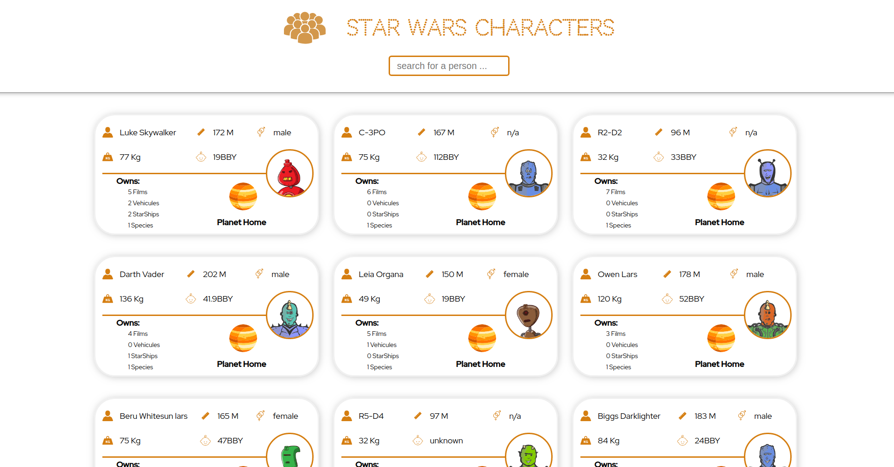

# Star Wars Characters

> This repository is a star wars IPA explorer where we can explorer different star wars characters and filter throw them and also access to more details for there home planet as name of the planet and it's population, etc.



## Built With

- HTML, CSS,
- Flexbox,
- ReactJS.

## Live Demo

[Live Demo Link](https://raw.githack.com/elmejdki/star-wars-test/master/build/index.html)

## Getting Started

To get a local copy up and running follow these simple example steps.

### Prerequisites

In order to run this project in your machine you must have the latest version of nodejs installed after that you can open the project folder in a command prompt and run:

```
npm install
```

to install all the required dependencies then to start the project you should run:

```
npm start
```

## Author

👤 **Zakariae El Mejdki**

- Github: [@elmejdki](https://github.com/elmejdki)
- Twitter: [@ZakariaeElMEjdki](https://twitter.com/0ca7848f87ab470)
- Linkedin: [Zakariae El Mejdki](https://www.linkedin.com/in/zakariae-el-mejdki-644898139/)

## 🤝 Contributing

Contributions, issues and feature requests are welcome!

Feel free to check the [issues page](https://github.com/elmejdki/TNW-clone/issues).

## Show your support

Give a ⭐️ if you like this project!

## Acknowledgments

a big hat to me and my partner Brenda and anyone who help us either by openning issues on this repository or reviewing our code :)

## 📝 License

This project is [MIT](lic.url) licensed.
